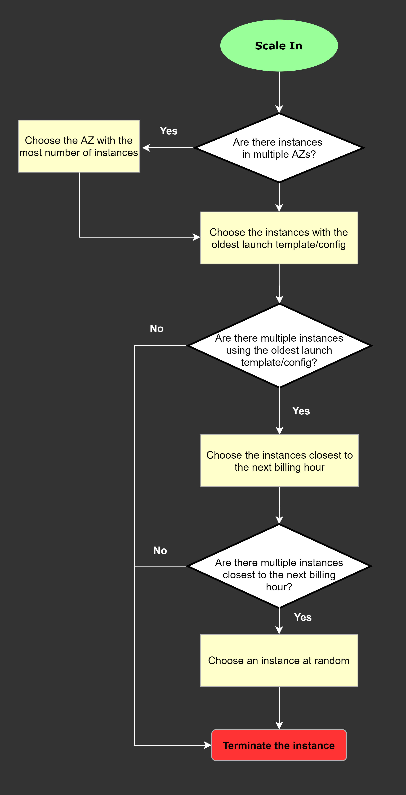

- Будь внимателен c `SELECT TWO`
- Будь внимателен с `cost-effective solution`
- Будь внимателен c `the easiest to implement`

---
- Active Directory == AWS Directory Service AD Connector

- IAM Roles vs IAM Group - IAM Groups is incorrect because this is just a collection of IAM users. Groups let you specify permissions for multiple users, which can make it easier to manage the permissions for those users. In this scenario, the more suitable one to use is IAM Roles in order for permissions to create AWS Directory Service resources.

- IAM DB Authentication - An authentication token is a unique string of characters that Amazon RDS generates on request. Authentication tokens are generated using AWS Signature Version 4. Each token has a lifetime of 15 minutes. You don't need to store user credentials in the database, because authentication is managed externally using IAM. You can also still use standard database authentication.

- Remember that the DynamoDB Stream feature is not enabled by default.

- Amazon Macie is an ML-powered security service that helps you prevent data loss by automatically discovering, classifying, and protecting sensitive data stored in Amazon S3
- GuardDuty is just a threat detection service that continuously monitors for malicious activity and unauthorized behavior to protect your AWS accounts and workloads

- You can invoke an AWS Lambda function from an Amazon Aurora MySQL

- creating your own Lambda function for this scenario is not really necessary. It is much simpler to control ECS task directly as target for the CloudWatch Event rule

- Temporary credentials are useful in scenarios that involve identity federation, delegation, cross-account access, and IAM roles. In this example, it is called enterprise identity federation considering that you also need to set up a single sign-on (SSO) capability.

- 

- Although the use of Secrets Manager in securing sensitive data in ECS is valid, Amazon ECS doesn't support resource-based policies. An example of a resource-based policy is the S3 bucket policy. An ECS task assumes an execution role (IAM role) to be able to call other AWS services like AWS Secrets Manager on your behalf.

- Remember that a relational database system does not scale well for the following reasons:
  - It normalizes data and stores it on multiple tables that require multiple queries to write to disk.
  - It generally incurs the performance costs of an ACID-compliant transaction system.
  - It uses expensive joins to reassemble required views of query results.

For DynamoDB, it scales well due to these reasons:
- Its schema flexibility lets DynamoDB store complex hierarchical data within a single item. DynamoDB is not a totally schemaless database since the very definition of a schema is just the model or structure of your data.
- Composite key design lets it store related items close together on the same table.

- Enhanced Monitoring is a feature of Amazon RDS. Not EC2.

- Although EFS supports concurrent access to data, it does not have the high-performance ability that is required for machine learning workloads.

- Use simple scaling is incorrect because you need to wait for the cooldown period to complete before initiating additional scaling activities. Target tracking or step scaling policies can trigger a scaling activity immediately without waiting for the cooldown period to expire.

- AWS Lambda is a better option than Amazon ECS since it can handle a sudden burst of traffic within seconds and not minutes.

- Although Lambda encrypts the environment variables in your function by default, the sensitive information would still be visible to other users who have access to the Lambda console. This is because Lambda uses a default KMS key to encrypt the variables, which is usually accessible by other users.

- AWS Resource Access Manager (RAM) is a service that enables you to easily and securely share AWS resources with any AWS account or within your AWS Organization.

Amazon S3 supports the following destinations where it can publish events:
- Amazon Simple Notification Service (Amazon SNS) topic
- Amazon Simple Queue Service (Amazon SQS) queue
- AWS Lambda

- Take note that Amazon S3 event notifications are designed to be delivered at least once and to one destination only. You cannot attach two or more SNS topics or SQS queues for S3 event notification. 

- AWS Shield Advanced provides additional detection and mitigation against large and sophisticated DDoS attacks, near real-time visibility into attacks, and integration with AWS WAF, a web application firewall
- Even though AWS WAF can help you block common attack patterns to your VPC such as SQL injection or cross-site scripting, this is still not enough to withstand DDoS attacks

- Remember that the more distinct partition key values your workload accesses, the more those requests will be spread across the partitioned space. Conversely, the less distinct partition key values, the less evenly spread it would be across the partitioned space, which effectively slows the performance.

